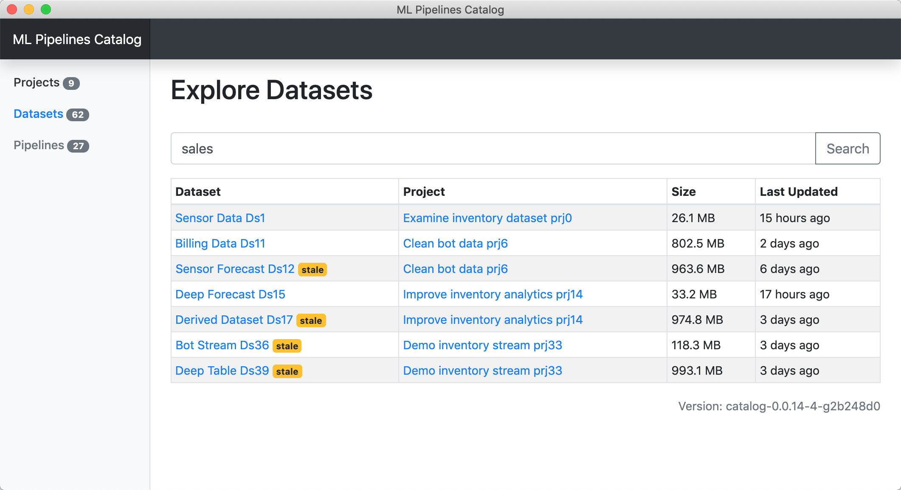
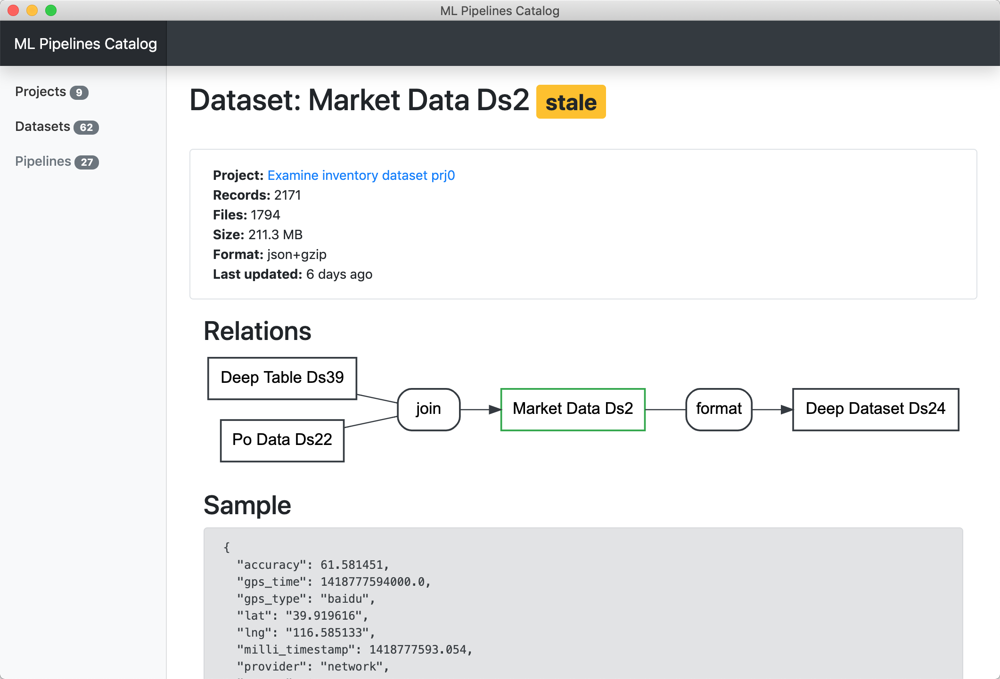

# ml-pipelines

Applications for managing machine learning pipelines and human workflows around them, published under BSD-2 license.

At the moment of writing this repository includes only the MLP Catalog - a Django application for exploring projects and datasets stored within the metadata library.

## Explore Datasets

Searching datasets across projects.

## View Datasets

View dataset properties and relations.

## Specs

Application functionality is being covered with [event-driven specs](https://abdullin.com/sku-vault/event-driven-verification/). This captures business logic and UX flows in non-fragile way.

## Getting started

Application is build and tested with Python 3.7.

Prerequisites:

- Python 3.7
- [graphviz](https://www.graphviz.org)
- [LMDB](https://lmdb.readthedocs.io/en/release/)
- [virtualenv](https://virtualenv.pypa.io/en/latest/)

To get started, go to the `mlp` folder and:

1) set up a _virtualenv_ in `mlp` folder and activate it;
3) `pip install -r requirements.txt` - install all the dependencies;
4) `python manage.py specs` - to run tests;
5) `python manage.py demo && python manage.py runserver` to fill up DB with demo data and launch the web UI (available at localhost:8000)

